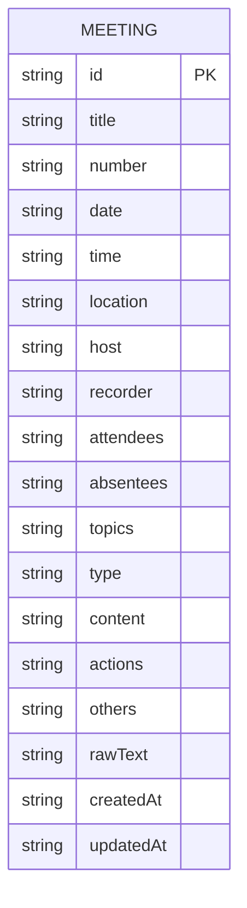

# 酒店智能会议记录助手 - 技术架构文档

## 1. 架构设计
```mermaid
graph TD
    Frontend["前端 (React + Vite + Tailwind CSS)"]
    Storage["数据存储 (localStorage + IndexedDB)"]
    
    Frontend --&gt; Storage
    
    style Frontend fill:#165DFF
    style Storage fill:#94A3B8
```

## 2. 技术描述
- **前端**：React@18 + Tailwind CSS@3 + Vite
- **初始化工具**：Vite
- **后端**：无（纯前端应用）
- **数据库**：localStorage + IndexedDB（本地存储）
- **其他依赖**：
  - React Router（路由管理）
  - Lucide React（图标库）

## 3. 路由定义
| 路由 | 用途 |
|------|------|
| / | 首页，显示快捷入口和历史记录 |
| /create | 创建新会议 |
| /meeting/:id | 会议详情/编辑页面 |
| /meeting/:id/record | 录音页面 |
| /meeting/:id/preview | 预览页面 |

## 4. 数据模型

### 4.1 数据模型定义


### 4.2 数据结构定义
```typescript
interface ActionItem {
  id: string;
  content: string;
  responsible: string;
  deadline: string;
  standard: string;
  remark: string;
}

interface Meeting {
  id: string;
  title: string;
  number: string;
  date: string;
  startTime: string;
  endTime: string;
  location: string;
  host: string;
  hostTitle: string;
  recorder: string;
  recorderTitle: string;
  attendees: string;
  absentees: string;
  absenteeReason: string;
  topics: string[];
  type: string;
  departmentReports: string;
  discussions: string;
  actions: ActionItem[];
  others: string;
  rawText: string;
  createdAt: string;
  updatedAt: string;
}
```
